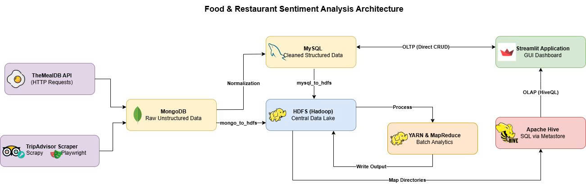
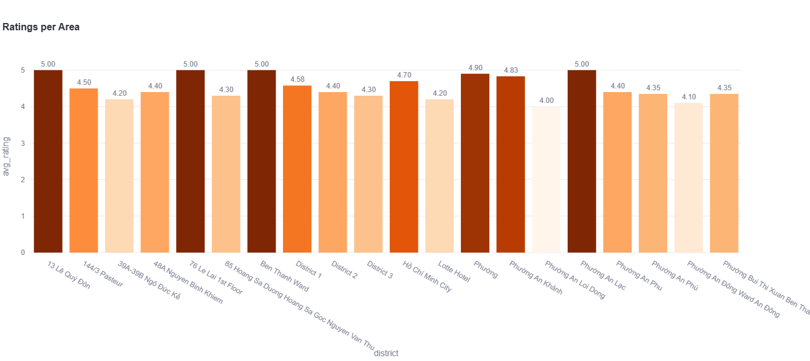
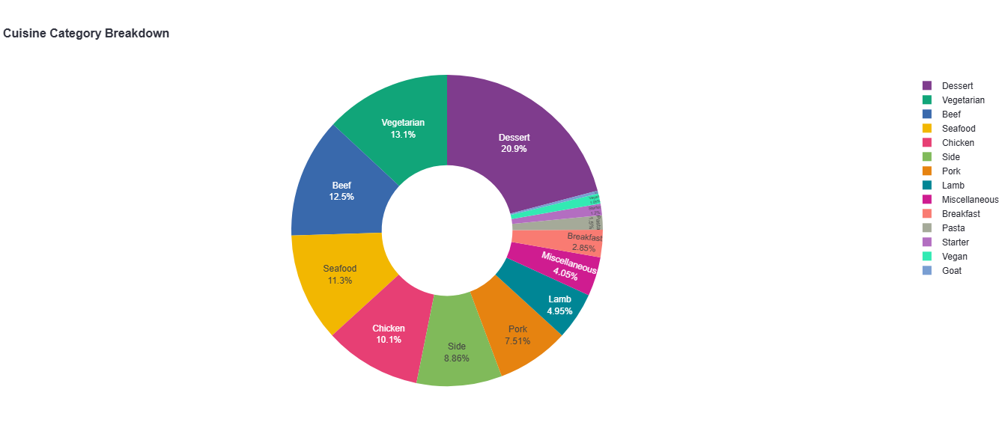
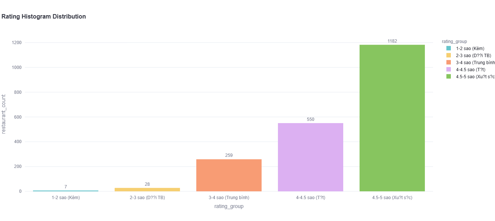
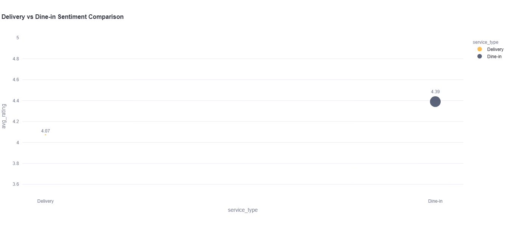
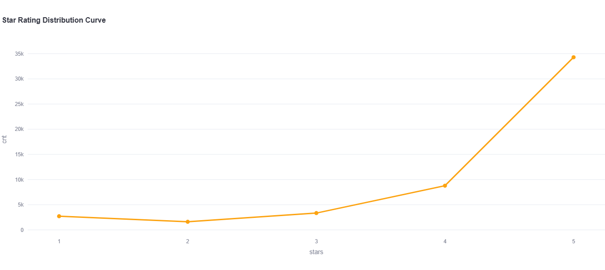
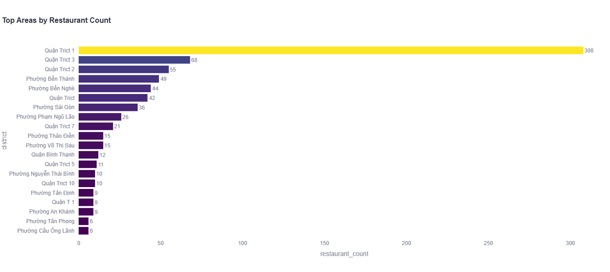

# Food & Restaurant Sentiment Analysis System

[](https://ubuntu.com/)
[](https://openjdk.org/)
[](https://hadoop.apache.org/)
[](https://hive.apache.org/)
[](https://www.mongodb.com/)
[](https://www.mysql.com/)
[](https://www.python.org/)
[](https://streamlit.io/)

A production-grade, distributed Big Data engineering pipeline and interactive analytical dashboard designed to ingest, process, and analyze culinary sentiment data. Built using a **Hybrid OLTP/OLAP (Polyglot Persistence)** architecture running on **Ubuntu 24.04 LTS via WSL2**, the system orchestrates web scrapers, REST APIs, HDFS distributed storage, MapReduce batch jobs, Apache Hive data warehousing, and a Streamlit frontend.

---

## Table of Contents

- [Key Features](#key-features)
- [System Architecture & Data Flow](#system-architecture--data-flow)
- [Analytics & Dashboard Showcase](#analytics--dashboard-showcase)
- [Technology Stack](#technology-stack)
- [Project Directory Structure](#project-directory-structure)
- [Quick Start Guide](#quick-start-guide)
  - [Prerequisites](#prerequisites)
  - [1. Clone Repository & Setup Permissions](#1-clone-repository--setup-permissions)
  - [2. One-Click Infrastructure Installation](#2-one-click-infrastructure-installation)
  - [3. Run the Pipeline](#3-run-the-pipeline)
  - [4. Stop Services & Teardown](#4-stop-services--teardown)
- [MapReduce Analytics Jobs](#mapreduce-analytics-jobs)
- [Apache Hive Analytics Views](#apache-hive-analytics-views)
- [Contributors & Git Commit Tracking](#contributors--git-commit-tracking)
- [Documentation & Deep Dives](#documentation--deep-dives)

---

## Key Features

- **Automated Data Scraping & Ingestion**: Resilient Web scrapers (Scrapy) and REST API clients (TheMealDB) with built-in anti-bot fallbacks and offline seed capabilities.
- **Polyglot Persistence**:
  - **MongoDB (NoSQL Staging)**: Ingests unstructured/semi-structured raw restaurant reviews and culinary recipes.
  - **MySQL (Relational OLTP)**: Stores normalized relational data for fast CRUD operations and web client transactions.
  - **Hadoop HDFS (Distributed Data Lake)**: Acts as the storage backplane for bulk `.jsonl` datasets and MapReduce job artifacts.
- **Distributed Analytics (MapReduce Engine)**: 8 custom Python MapReduce (`mrjob`) analysis jobs executing over Hadoop Streaming.
- **Data Warehousing (Apache Hive)**: OLAP analytical views mapping HDFS directories for complex SQL aggregations and reporting.
- **Interactive Web Dashboard (Streamlit)**: Single-pane UI supporting real-time MySQL CRUD management, interactive OLAP chart visualizations, and cluster status monitoring.
- **Zero-Touch Infrastructure Automation**: Unified shell automation script `install_infra.sh` installing Java 8, Hadoop 3.3.6, Hive 3.1.3, MySQL 8.0, MongoDB 8.0, and Python `venv` on clean Ubuntu 24.04 environments.

---

## System Architecture & Data Flow

Below is the end-to-end architecture diagram detailing data flow from web/API sources to staging databases, HDFS distributed storage, MapReduce processing, Hive warehousing, and Streamlit visualization.



```text
[ TripAdvisor Scraper (Scrapy) ] --+
                                    +--> [ MongoDB (Staging) ] --+
[ TheMealDB API Client ] ----------+                             |
                                                                 +--> [ HDFS (.jsonl) ] --> [ MapReduce (8 Jobs) ] --> [ HDFS (Results) ]
                                   +--> [ MySQL (OLTP) ] -------+                                                            |
                                              |                                                                               v
                                     [ Streamlit CRUD ]                                                              [ Apache Hive (OLAP) ]
                                              |                                                                               |
                                              +------------------------------------------------------------------------> [ Streamlit Reports ]
```

### Contextual Data Link: TripAdvisor ↔ TheMealDB
- **TripAdvisor**: Contains restaurant listings, user ratings, geographic metadata, and detailed review text across Ho Chi Minh City.
- **TheMealDB**: Contains international culinary recipes, categories, regional areas, and structured ingredient lists.
- **Cross-Analysis Connection (`mr_ingredient_match.py`)**: Uses ingredient vocabulary from TheMealDB to parse and match ingredient mentions inside TripAdvisor reviews, identifying popular culinary ingredients and sentiment correlation.

---

## Analytics & Dashboard Showcase

The interactive Streamlit dashboard renders real-time OLAP insights generated by Hive queries and MapReduce batch outputs.

| Ratings per District | Cuisine Category Breakdown |
| :---: | :---: |
|  |  |

| Rating Distribution Histogram | Delivery vs. Dine-in Sentiment |
| :---: | :---: |
|  |  |

| Star Rating Distribution Curve | Top Districts by Restaurant Density |
| :---: | :---: |
|  |  |

---

## Technology Stack

| Component | Version | Role in Architecture |
| :--- | :--- | :--- |
| **Java OpenJDK** | `8 LTS` | Mandatory runtime for Hadoop & Hive (prevents Kryo serialization issues) |
| **Apache Hadoop** | `3.3.6` | Distributed storage backplane (HDFS) & YARN execution framework |
| **Apache Hive** | `3.1.3` | Data warehouse providing OLAP SQL query capabilities on top of HDFS |
| **MongoDB Community** | `8.0 LTS` | Semi-structured staging database for raw scraper JSON payloads |
| **MySQL Server** | `8.0` | Relational OLTP database powering Streamlit transactional CRUD |
| **Python** | `3.10 / 3.11` | Core processing language (`mrjob` MapReduce, ETL, Streamlit) |
| **Streamlit** | `1.35.0` | Interactive web dashboard running on port `8501` |
| **Scrapy** | `2.11.0` | Async crawling framework for TripAdvisor restaurant & review extraction |

---

## Project Directory Structure

```text
food-sentiment-analytics-platform/
│
├── bin/                        # Infrastructure & orchestration shell scripts
│   ├── install_infra.sh        # One-time automated installer (Java, Hadoop, Hive, DBs, venv)
│   ├── run.sh                  # Main entry point: starts services, runs pipeline & Streamlit
│   └── stop.sh                 # Graceful service shutdown (supports --backup and --cleandata)
│
├── conf/                       # Shared configuration templates
│   ├── hadoop/                 # core-site.xml, hdfs-site.xml, yarn-site.xml, mapred-site.xml
│   ├── hive/                   # hive-site.xml (metastore & Java 8 setup)
│   └── mrjob.conf              # Hadoop Streaming runner configuration
│
├── src/
│   ├── crawler/                # Data collection & web scraping modules
│   │   ├── tripadvisor_job/    # Scrapy spider for TripAdvisor data extraction
│   │   ├── fetch_mealdb.py     # TheMealDB REST API client
│   │   └── seed/               # Offline fallback datasets for offline development
│   ├── ingest/                 # Data normalization, ETL & schema initialization
│   │   ├── init_db.py          # MySQL schema setup & MongoDB data normalization
│   │   ├── import_tripadvisor.py  # Load raw scraped JSON into MongoDB
│   │   ├── mongo_to_hdfs.py    # Export MongoDB collections → HDFS (.jsonl)
│   │   ├── mysql_to_hdfs.py    # Export MySQL tables → HDFS (.jsonl)
│   │   ├── hive_schema.sql     # External table definitions for Hive
│   │   └── hive_analytics.sql  # 7 Analytical OLAP SQL views for Hive
│   ├── mapreduce/              # Distributed MapReduce analytics jobs (Python mrjob)
│   │   ├── mr_rating_by_district.py
│   │   ├── mr_cuisine_count.py
│   │   ├── mr_rating_bucket.py
│   │   ├── mr_sentiment_analysis.py
│   │   ├── mr_ingredient_match.py
│   │   ├── mr_top_reviewed.py
│   │   ├── mr_review_distribution.py
│   │   ├── mr_delivery_analysis.py
│   │   └── run_all_jobs.py     # Batch runner & summary generator for all 8 jobs
│   ├── streamlit_app/          # Web frontend application
│   │   ├── app.py              # Main dashboard UI (CRUD + OLAP Visuals + DevOps Control)
│   │   └── hive_connector.py   # Multi-mode Hive query engine (pyhive -> CLI -> fallback)
│   └── backup/                 # Data protection utilities
│       ├── db_backup.sh        # Automated MySQL & MongoDB logical backup
│       └── db_restore.sh       # Database restoration utility
│
├── docs/                       # Comprehensive system documentation
│   ├── ARCHITECTURE.md         # Detailed architectural design & data flow
│   ├── MASTERPLAN.md           # Engineering implementation phases
│   ├── REQUIREMENTS.md         # System requirements & software specifications
│   ├── TROUBLESHOOTING.md      # Diagnostic & resolution guide
│   ├── assets/                 # System architecture diagram & dashboard plots
│   └── process/                # Execution logs and debug session transcripts
│
├── requirements.txt            # Python dependencies
├── SETUP_GUIDE.md              # Environment setup walkthrough
└── TEST_PLAN.md                # System verification & test matrix
```

---

## Quick Start Guide

### Prerequisites
- **Operating System**: Windows 10/11 running **WSL2 with Ubuntu 24.04 LTS**.
- **Hardware**: Minimum 8 GB RAM, 10 GB free disk space.
- **Network**: Active internet connection (for downloading Hadoop, Hive, and apt packages on first run).

### 1. Clone Repository & Setup Permissions

Run the following commands inside your Ubuntu WSL2 terminal:

```bash
cd /mnt/d/Project   # Or your preferred working directory
git clone https://github.com/darktheDE/food-sentiment-analytics-platform.git
cd food-sentiment-analytics-platform
chmod +x bin/*.sh src/backup/*.sh
```

### 2. One-Click Infrastructure Installation

Execute the infrastructure provisioner **once** on a fresh Ubuntu installation:

```bash
./bin/install_infra.sh
```

This script automatically:
- Installs Java 8 OpenJDK, Hadoop 3.3.6, Hive 3.1.3, MongoDB 8.0, and MySQL 8.0.
- Applies pre-configured XML settings from `conf/` to the installed infrastructure components.
- Configures dedicated MySQL `hive` metastore credentials and downloads required JDBC drivers.
- Initializes the Python virtual environment (`venv`) and installs `requirements.txt`.
- Sets up the MySQL schema and populates offline seed data.

### 3. Run the Pipeline

Launch the services and open the dashboard:

```bash
# Option A: Run pipeline using existing local/seed data:
./bin/run.sh

# Option B: Fetch fresh data via scrapers -> ingest -> launch Streamlit:
./bin/run.sh --crawl

# Option C: Full pipeline (Crawl -> Ingest -> Execute 8 MapReduce jobs -> Streamlit):
./bin/run.sh --crawl --jobs
```

Once started, access the web UI from your browser at: **`http://localhost:8501`**

### 4. Stop Services & Teardown

To shut down running background daemons (Hadoop NameNode/DataNode, HiveServer2, MySQL, MongoDB):

```bash
./bin/stop.sh                   # Standard graceful shutdown
./bin/stop.sh --backup          # Take logical backup before stopping
./bin/stop.sh --cleandata       # Shutdown and wipe data (resets environment for testing)
```

---

## MapReduce Analytics Jobs

The system features 8 independent Python MapReduce jobs powered by `mrjob` running over Hadoop Streaming:

| Job Module | Primary Input | Description |
| :--- | :--- | :--- |
| `mr_rating_by_district.py` | `restaurants.jsonl` | Computes average restaurant star ratings per parsed urban district |
| `mr_cuisine_count.py` | `meals.jsonl` | Aggregates category and cuisine area frequencies from recipe data |
| `mr_rating_bucket.py` | `restaurants.jsonl` | Groups restaurants into rating buckets (`1-2`, `2-3`, `3-4`, `4-5` stars) |
| `mr_sentiment_analysis.py` | `restaurants.jsonl` | Evaluates sentiment scores from review text per restaurant |
| `mr_ingredient_match.py` | `restaurants.jsonl` | Matches recipe ingredients against customer reviews to determine ingredient popularity |
| `mr_top_reviewed.py` | `restaurants.jsonl` | Ranks top 10 most-reviewed culinary establishments |
| `mr_review_distribution.py` | `restaurants.jsonl` | Analyzes star rating distribution across individual user reviews |
| `mr_delivery_analysis.py` | `restaurants.jsonl` | Compares average ratings between delivery-related reviews vs. dine-in reviews |

---

## Apache Hive Analytics Views

Hive external tables map directly to HDFS datasets, presenting 7 pre-computed OLAP views:

| View Name | Analytics Focus |
| :--- | :--- |
| `view_rating_by_district` | District-level average rating and total restaurant density |
| `view_cuisine_frequency` | Distribution of recipe categories from TheMealDB |
| `view_cuisine_area` | Geographic origin breakdown of culinary dishes |
| `view_top_districts` | Ranking of districts by restaurant concentration |
| `view_rating_histogram` | Macro-level distribution of restaurant rating brackets |
| `view_review_distribution` | Granular review rating breakdown (1 to 5 stars) |
| `view_delivery_sentiment` | Comparative sentiment rating between food delivery and dine-in reviews |

---

## Contributors & Git Commit Tracking

Contributions tracked directly from the repository's Git commit history:

| Contributor | Git Profile / Email | Commits | Key Technical Contributions |
| :--- | :--- | :---: | :--- |
| **Đỗ Kiến Hưng** | [`@darktheDE`](https://github.com/darktheDE)<br>`kienhung.do1105@gmail.com` | **36** | • **System Architecture & Orchestration**: Designed hybrid OLTP/OLAP architecture and wrote execution lifecycle scripts (`install_infra.sh`, `run.sh`, `stop.sh`).<br>• **Big Data Infrastructure**: Configured Hadoop 3.3.6 (HDFS/YARN) and Hive 3.1.3 metastore with Java 8 runtime compatibility.<br>• **Data Pipelines & ETL**: Built MySQL/MongoDB-to-HDFS export tools, Hive schemas, and OLAP analytics SQL views.<br>• **MapReduce Analytics Engine**: Authored 8 Python `mrjob` batch jobs and batch execution runner (`run_all_jobs.py`).<br>• **Full-Stack Dashboard**: Developed Streamlit UI with MySQL CRUD module, Hive connector module, and backup/restore utilities (`db_backup.sh`, `db_restore.sh`). |
| **Nguyen Van Quang Duy** | [`@QuangDuyReal`](https://github.com/QuangDuyReal)<br>`fansjaki@gmail.com` | **12** | • **Web Scraping Infrastructure**: Created TripAdvisor Scrapy spider framework (`src/crawler/tripadvisor_job/`) for multi-field restaurant & review crawling.<br>• **REST API Client**: Implemented TheMealDB recipe collector (`src/crawler/fetch_mealdb.py`).<br>• **Crawler Resilience**: Engineered anti-bot mitigation, header rotation, captcha handling, and seed data fallback triggers.<br>• **Data Staging**: Configured initial MongoDB raw data staging layer. |

---

## Documentation & Deep Dives

For further details on configuration, maintenance, and diagnostics, refer to:

- 📖 [**Setup Guide**](SETUP_GUIDE.md) — Comprehensive environment preparation guide.
- 📖 [**Manual Guide**](MANUAL_GUIDE.md) — Step-by-step user guide for CLI scripts and Web UI.
- 🏗️ [**Architecture Overview**](docs/ARCHITECTURE.md) — In-depth architectural patterns and flow diagrams.
- 🛠️ [**Troubleshooting Guide**](docs/TROUBLESHOOTING.md) — Common runtime errors and solution matrix.
- 🧪 [**Test Plan**](TEST_PLAN.md) — System testing framework and test cases.